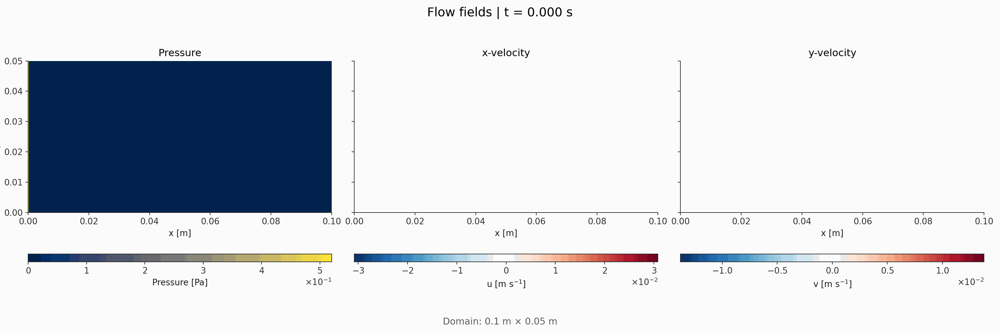

# PPP MPI Assessment

In this repo I submit my distributed Navier Stokes solver along with the extension tasks. 

I employ grid decomposition, optimising for near equal aspect ratios on the sub regions. I opt for clean communications through a modular design, custom MPI types, and minimising communication volume, and have attempted to follow best practices in software development by encapsulating functionality in data structures with clean access patterns and namespaces that clearly delineate functionality.



*Post processed output of the core code with `Nx = 401`, `Ny = 101`*

For the extension, I implement a simple square obstacle of custom size. This utilises a "mask" of sorts to represent the obstacle. I modified the core routine by ensuring no slips boundary conditions are imposed on the walls of the obstacle, and velocity is zeroed throughout its body. This does incur additional overhead, due to the neccessity of expensive conditionals.


*Post processed output of the extension code with `Nx = 401`, `Ny = 101`*

Details on the individual sections of this submission can be found in individual README.md files in `./core` and `./extension`. This explain how to run each part, and key details of the implementation.

## Using the submission code

To get started, clone the repository:

```bash
git clone https://github.com/ese-ada-lovelace-2025/ppp-mpi-assessment-ada-ld2022/
```

You can install the relevant dependencies with

```bash
sudo apt update
sudo apt install build-essential openmpi-bin libopenmpi-dev python3 python3-pip
```

To install the post processing dependencies using the `pyroject.toml`, you can run

```bash
python3 -m venv ./venv
source ./venv/bin/activate
pip install .
```

Navigate to the repository directory, and then you may compile and run the code using the pattern

```bash
mpicxx -std=c++17 -O2 -o solver-<core/extension> <core/extension>/solver.cpp
mpirun -np nprocs ./solver-<core/extension> --Nx Nx --Ny Ny --Lx Lx --Ly Ly
```

and you may run the postprocessing script afterwards using

```bash
python3 postprocess.py --<core/extension/root>
```

To reproduce the attached figures, run:

```bash
mpicxx -std=c++17 -O2 -o solver-core core/solver.cpp
mpirun -np nprocs ./solver-core --Nx 401 --Ny 101
python3 postprocess.py --core

mpicxx -std=c++17 -O2 -o solver-extension extension/solver.cpp
mpirun -np nprocs ./solver-extension --Nx 401 --Ny 101
python3 postprocess.py --extension
```

## Project structure

The structure of my submission can be best understood by a diagram:

```plaintxt
.
├── core/                   // core functionality
│   ├── solver.cpp
│   ├── solver.h
│   └── README.md           // core docs
|
├── extension/              // extension functionality
│   ├── solver.cpp
│   ├── solver.h
│   └── README.md           // extension docs
|
├── postprocessing.py       // postproc script
|
└── out/                    // output data
    |
    ├── core/
    |   ├── field_flows.gif     // generated by postproc script
    |   |
    |   ├── P/                  // Pressure
    |   |    ├── P_rank0.dat     // Proc 1 history
    |   |    ├── P_rank1.dat     // Proc 2 history
    |   |    └── ... 
    |   ├── u/                  // u velocity
    |   |    ├── u_rank0.dat
    |   |    └── ...
    |   └── v/                  // v velocity
    |        ├── v_rank0.dat
    |        └── ... 
    |       
    └── extension/
        ├── field_flows.gif 
        ├── P/              
        ├── u/              
        └── v/   
```

Note two things:

- In particular, the structure of the `out/` directory. The code creates this sub folder (along with `/core` and `/extension`, depending on the script that is run) from wherever it is run. All subfolders for the different fields are also created automatically. The post processing script is sensitive to this file structure. If you run the script as intended (i.e., from the root), then when it is complete you can just run `python3 postprocessing.py --<core/extension>`. If you want to specify a particular path to the data directory you can use `python3 postprocessing.py --root "./path/to/file"`, but note the structure of the data directory and naming conventions should not be altered.
- A `plan.md` is also included. This is a scrap notebook I have used throughout the project to record progress at intervals. I thought it would be useful to include in the submission as a record along with the commit history.